# PraiseFlow - Worship Song Chord Sheet Finder

A bilingual (Korean/English) AI-powered search system for finding worship song chord sheets. Built with RAG (Retrieval-Augmented Generation) architecture using **Gemini 3 Pro** for OCR/metadata extraction and **8-way hybrid search** with Cohere reranking.


## Table of Contents

- [Overview](#overview)
- [Tech Stack](#tech-stack)
- [Architecture](#architecture)
  - [System Overview](#system-overview)
  - [High-Level Data Flow](#high-level-data-flow)
  - [Complete User Journey](#complete-user-journey)
- [RAG Workflow](#rag-workflow)
  - [RAG Pipeline Overview](#rag-pipeline-overview)
  - [8-Way Hybrid Search Detail](#8-way-hybrid-search-detail)
- [Database Schema](#database-schema)
  - [Entity Relationship Diagram](#entity-relationship-diagram)
- [Search Algorithm](#search-algorithm)
- [API Reference](#api-reference)
- [Setup Guide](#setup-guide)
- [Cost Analysis](#cost-analysis)
- [Analytics & Tracking Flow](#analytics--tracking-flow)
- [Component Architecture](#component-architecture)
- [Frontend State Flow](#frontend-state-flow)
- [Project Structure](#project-structure)

---

## Overview

PraiseFlow helps worship teams find chord sheets by searching through a database of scanned/photographed sheet music. Users can search in Korean or English, and the system handles:

- **Korean text variations**: "위대하신주" = "위대하신 주" = "위 대 하 신 주"
- **Cross-language search**: "Holy Forever" finds "거룩 영원히"
- **Typo tolerance**: "위대하신쥬" -> "위대하신주"
- **Multi-page sheets**: Automatically groups pages together
- **Key selection**: Filter by musical key (G, A, C, Dm, etc.)

---

## Tech Stack

| Layer | Technology | Purpose | Cost |
|-------|------------|---------|------|
| **Frontend** | Next.js 16 (App Router) | React 19 framework with server components | Free |
| **UI** | shadcn/ui + Tailwind CSS 4 | Component library and styling | Free |
| **Database** | Supabase (PostgreSQL + pgvector) | Data storage + lyrics_chunks table | Free/$25mo |
| **Vector Search** | Voyage AI | voyage-multilingual-2 (1024d Korean-optimized) | ~$0.0001/query |
| **OCR/Extraction** | Gemini 3 Pro Vision | Extract metadata from chord sheet images | $1.25/1K images |
| **Reranking** | Cohere Rerank 3 | Cross-encoder reranking (Vercel-optimized) | ~$0.002/query |
| **AI Chat** | Claude Sonnet 4 | Fallback when no results found | $3-15/1M tokens |
| **Storage** | Supabase Storage | Image file hosting | Included |
| **Monitoring** | Sentry | Error tracking + session replay | Usage-based |
| **Analytics** | Vercel Analytics | Usage tracking | Free on Vercel |
| **Language** | TypeScript 5 | Type-safe development | Free |

---

## Architecture

### System Overview

```mermaid
flowchart TB
    subgraph CLIENT["🖥️ Client Browser"]
        UI[React Chat Interface]
        LC[Local Storage<br/>Session ID]
    end

    subgraph NEXTJS["⚡ Next.js 16 App Router"]
        PAGE["/app/page.tsx<br/>Main Chat UI"]
        API_CHAT["/api/chat<br/>Search & Response"]
        API_ANALYTICS["/api/analytics/*<br/>Tracking Endpoints"]
        API_ADMIN["/api/admin/*<br/>Dashboard APIs"]
    end

    subgraph SERVICES["🔌 External Services"]
        VOYAGE[Voyage AI<br/>Embeddings]
        COHERE[Cohere<br/>Reranking]
        CLAUDE[Claude Sonnet<br/>AI Fallback]
        GOOGLE[Google Images<br/>Search Fallback]
        SENTRY[Sentry<br/>Error Tracking]
    end

    subgraph DATABASE["🗄️ Supabase PostgreSQL"]
        SONGS[(song_images)]
        ALIASES[(song_aliases)]
        CHUNKS[(lyrics_chunks)]
        ANALYTICS_DB[(analytics_*)]
    end

    UI --> PAGE
    PAGE --> API_CHAT
    PAGE --> API_ANALYTICS
    API_CHAT --> VOYAGE
    API_CHAT --> COHERE
    API_CHAT --> CLAUDE
    API_CHAT --> GOOGLE
    API_CHAT --> SONGS
    API_CHAT --> ALIASES
    API_CHAT --> CHUNKS
    API_ANALYTICS --> ANALYTICS_DB
    API_ADMIN --> ANALYTICS_DB
    UI --> SENTRY
    LC --> UI
```



### High-Level Data Flow

```mermaid
flowchart LR
    subgraph INGESTION["📥 One-Time Ingestion"]
        IMG[📷 Images] --> GEMINI[Gemini 3 Pro<br/>OCR + Metadata]
        GEMINI --> EMBED[Voyage AI<br/>Embeddings]
        EMBED --> STORE[(Supabase)]
    end

    subgraph RUNTIME["🔄 Runtime Search"]
        QUERY[🔍 User Query] --> HYBRID[8-Way Hybrid<br/>Search]
        HYBRID --> RRF[RRF Fusion]
        RRF --> RERANK[Cohere<br/>Reranking]
        RERANK --> RESPONSE[📤 Response]
    end

    STORE --> HYBRID
```



### Complete User Journey

```mermaid
sequenceDiagram
    autonumber
    participant U as 👤 User
    participant F as 🖥️ Frontend
    participant A as 🔌 /api/chat
    participant H as 🔍 Hybrid Search
    participant V as 🧠 Voyage AI
    participant C as 🔄 Cohere
    participant D as 🗄️ Database
    participant G as 🌐 Google
    participant AI as 🤖 Claude

    U->>F: Type "광대하신 주 G키"
    F->>F: Show loading spinner
    F->>A: POST {message, language, history}

    Note over A: Parse query & extract key
    A->>A: detectKeyQuery() → key="G"
    A->>A: extractSearchTerms() → "광대하신 주"

    A->>V: Generate query embedding
    V-->>A: 1024d vector

    par 8 Parallel Searches
        A->>D: 1. Exact ILIKE match
        A->>D: 2. BM25 full-text search
        A->>D: 3. Normalized Korean match
        A->>D: 4. Alias lookup
        A->>D: 5. Fuzzy Levenshtein
        A->>D: 6. Vector similarity
        A->>D: 7. OCR text search
        A->>D: 8. Lyrics chunks search
    end

    D-->>A: Results from all methods

    A->>A: RRF Fusion (combine ranks)
    A->>C: Rerank top candidates
    C-->>A: Reranked results

    A->>A: Group by song + filter by key

    alt Results Found
        A->>A: generateSmartResponse()
        A-->>F: {message, images[], availableKeys[]}
    else No Results
        A->>G: Google Image Search
        alt Google has results
            G-->>A: Image URLs
            A-->>F: {message, googleResults[]}
        else Google API limit
            A->>AI: Claude assistance
            AI-->>A: Helpful suggestions
            A-->>F: {message, googleSearchUrl}
        end
    end

    F->>F: Display results
    F->>F: trackSearch() async
    U->>F: Click on result
    F->>F: trackClick() async
```



### Detailed Architecture Diagram

```
+---------------------------------------------------------------------+
|                    PRAISEFLOW SYSTEM v2.0                           |
+---------------------------------------------------------------------+

+---------------------------------------------------------------------+
|                    1. IMAGE INGESTION PIPELINE                      |
|                       (One-time per image)                          |
+---------------------------------------------------------------------+
|                                                                     |
|   Local Images --> Gemini 3 Pro --> Voyage AI --> Supabase          |
|   (JPG/PNG)        (Vision/OCR)     (Dual Embed)  (Store all)       |
|                                                                     |
|   Gemini 3 Pro Extracts:                                            |
|   - song_title (original language)                                  |
|   - song_title_korean                                               |
|   - song_title_english                                              |
|   - song_key (G, A, Dm, etc.) ← Key-aware deduplication             |
|   - ocr_text (full page text)                                       |
|                                                                     |
|   Voyage AI Generates:                                              |
|   - embedding (512d voyage-3-lite)                                  |
|   - embedding_multilingual (1024d voyage-multilingual-2) ← Korean   |
|                                                                     |
|   Lyrics Chunking:                                                  |
|   - Split OCR text into lines → lyrics_chunks table                 |
|   - Each chunk gets 1024d multilingual embedding                    |
|                                                                     |
+---------------------------------------------------------------------+

+---------------------------------------------------------------------+
|                    2. HYBRID SEARCH PIPELINE                        |
|                     (Every user query)                              |
+---------------------------------------------------------------------+
|                                                                     |
|   User Query --> Preprocess --> 8 PARALLEL SEARCHES --> RRF Fusion  |
|   "Holy Forever"                                                    |
|                                                                     |
|   ┌─────────────────────────────────────────────────────────────┐   |
|   │           ALL 8 METHODS RUN IN PARALLEL                     │   |
|   │                  (using Promise.all)                        │   |
|   │                                                             │   |
|   │  ┌───────┐ ┌───────┐ ┌───────┐ ┌───────┐ ┌───────┐        │   |
|   │  │ EXACT │ │ BM25  │ │NORMAL │ │ ALIAS │ │ FUZZY │        │   |
|   │  │ ILIKE │ │  FTS  │ │KOREAN │ │LOOKUP │ │LEVEN- │        │   |
|   │  │       │ │       │ │       │ │       │ │SHTEIN │        │   |
|   │  └───┬───┘ └───┬───┘ └───┬───┘ └───┬───┘ └───┬───┘        │   |
|   │      │         │         │         │         │             │   |
|   │  ┌───┴───┐ ┌───┴───┐ ┌───┴───┐                            │   |
|   │  │VECTOR │ │  OCR  │ │LYRICS │                            │   |
|   │  │MULTI- │ │ TEXT  │ │CHUNKS │  ← All use 1024d           │   |
|   │  │LINGUAL│ │       │ │       │    multilingual            │   |
|   │  └───┬───┘ └───┬───┘ └───┬───┘                            │   |
|   │      │         │         │                                 │   |
|   └──────┼─────────┼─────────┼─────────────────────────────────┘   |
|          │         │         │                                     |
|          ▼         ▼         ▼                                     |
|   ┌─────────────────────────────────────────────────────────────┐   |
|   │         RECIPROCAL RANK FUSION (RRF)                        │   |
|   │         Score = Σ 1/(60 + rank)                             │   |
|   └─────────────────────────────────────────────────────────────┘   |
|                              │                                      |
|                              ▼                                      |
|   ┌─────────────────────────────────────────────────────────────┐   |
|   │              COHERE RERANKING                               │   |
|   │                                                             │   |
|   │   Model: rerank-multilingual-v3.0                          │   |
|   │   Latency: ~200-400ms (Vercel-optimized)                   │   |
|   └─────────────────────────────────────────────────────────────┘   |
|                                                                     |
+---------------------------------------------------------------------+

+---------------------------------------------------------------------+
|                    3. RESPONSE GENERATION                           |
+---------------------------------------------------------------------+
|                                                                     |
|   Results Found?                                                    |
|        |                                                            |
|   +----+----+                                                       |
|   |         |                                                       |
|  YES        NO                                                      |
|   |         |                                                       |
|   v         v                                                       |
| Smart     Claude AI                                                 |
| Response  Assistance                                                |
| (FREE)    (~$0.003)                                                 |
|                                                                     |
+---------------------------------------------------------------------+

COST PER QUERY: ~$0.003 (Voyage + Cohere)
ONE-TIME BATCH: ~$0.62 (Gemini OCR for 498 images)
```

---

## RAG Workflow

### What is RAG?

**RAG (Retrieval-Augmented Generation)** combines search (retrieval) with AI generation. Instead of relying solely on an AI's training data, we:

1. **Retrieve** relevant documents from our database
2. **Augment** the AI prompt with this context
3. **Generate** a response based on actual data

### RAG Pipeline Overview


### 8-Way Hybrid Search Detail

```mermaid
flowchart TB
    QUERY["🔍 User Query<br/>'Holy Forever G키'"] --> PARSE

    subgraph PARSE["📝 Query Parsing"]
        P1[Extract Search Terms] --> P2[Detect Musical Key]
        P2 --> P3[Normalize Korean Text]
        P3 --> P4[Generate Embedding]
    end

    PARSE --> PARALLEL

    subgraph PARALLEL["⚡ 8 Parallel Search Methods"]
        direction TB
        S1["1️⃣ EXACT<br/>ILIKE '%title%'"]
        S2["2️⃣ BM25<br/>Full-Text Search"]
        S3["3️⃣ NORMALIZED<br/>Korean Spacing"]
        S4["4️⃣ ALIAS<br/>Cross-Language"]
        S5["5️⃣ FUZZY<br/>Levenshtein"]
        S6["6️⃣ VECTOR<br/>Semantic 1024d"]
        S7["7️⃣ OCR TEXT<br/>Image Content"]
        S8["8️⃣ LYRICS<br/>Chunk Search"]
    end

    PARALLEL --> RRF

    subgraph RRF["🔀 Reciprocal Rank Fusion"]
        direction LR
        F1["Score = Σ 1/(60 + rank)"]
        F2["Multi-method boost"]
    end

    RRF --> RERANK["🎯 Cohere Reranking<br/>rerank-multilingual-v3.0"]
    RERANK --> GROUP["📚 Group by Song<br/>Multi-page Detection"]
    GROUP --> FILTER["🎹 Filter by Key<br/>If requested"]
    FILTER --> RESULT["📤 Final Results"]
```



### Our RAG Implementation

#### Phase 1: Document Ingestion (One-time setup)

```
+---------------------------------------------------------------+
|  STEP 1: IMAGE UPLOAD                                         |
|  Script: scripts/process-images.ts                            |
|                                                               |
|  - Read images from local folder                              |
|  - Compute MD5 hash for duplicate detection                   |
|  - Skip already-processed images                              |
+---------------------------------------------------------------+
                              |
                              v
+---------------------------------------------------------------+
|  STEP 2: GEMINI 3 PRO VISION EXTRACTION                       |
|  API: gemini-3-pro-preview (Top-tier OCR as of Jan 2026)      |
|  Cost: ~$0.00125 per image                                    |
|                                                               |
|  Prompt: "Extract song metadata as JSON..."                   |
|                                                               |
|  Output:                                                      |
|  {                                                            |
|    "song_title": "Holy Forever",                              |
|    "song_title_korean": "거룩 영원히",                        |
|    "song_key": "D",  ← Key-aware (same title, diff key = OK)  |
|    "ocr_text": "Holy Forever\nCEC Worship\n..."               |
|  }                                                            |
+---------------------------------------------------------------+
                              |
                              v
+---------------------------------------------------------------+
|  STEP 3: DUAL EMBEDDING GENERATION                            |
|  API: Voyage AI                                               |
|                                                               |
|  1. voyage-3-lite (512d) - General purpose                    |
|     Cost: ~$0.00006 per embedding                             |
|                                                               |
|  2. voyage-multilingual-2 (1024d) - Korean optimized          |
|     Cost: ~$0.00012 per embedding                             |
|                                                               |
|  Input: Combined text (title + korean + english + ocr_text)   |
|  Output: Both vectors stored for hybrid search                |
+---------------------------------------------------------------+
                              |
                              v
+---------------------------------------------------------------+
|  STEP 4: LYRICS CHUNKING (for partial lyrics search)          |
|                                                               |
|  - Split ocr_text into individual lines                       |
|  - Generate 1024d multilingual embedding per line             |
|  - Store in lyrics_chunks table                               |
+---------------------------------------------------------------+
                              |
                              v
+---------------------------------------------------------------+
|  STEP 5: STORAGE                                              |
|  Database: Supabase (PostgreSQL + pgvector)                   |
|                                                               |
|  - Upload image to Supabase Storage                           |
|  - Insert metadata + embedding into song_images table         |
|  - Create indexes for fast search                             |
+---------------------------------------------------------------+
```

#### Phase 2: Query Processing (Every search)

```
+---------------------------------------------------------------+
|  STEP 1: QUERY NORMALIZATION                                  |
|                                                               |
|  Input: "거룩 영원히 악보 찾아줘"                             |
|                                                               |
|  Process:                                                     |
|  1. Remove filler words: 악보, 찾아줘, 코드, key, sheet...    |
|  2. Result: "거룩 영원히"                                     |
|  3. Normalize Korean: "거룩영원히" (NFC + remove spaces)      |
+---------------------------------------------------------------+
                              |
                              v
+---------------------------------------------------------------+
|  STEP 2: PARALLEL SEARCH (All run simultaneously)             |
|                                                               |
|  +-------------------------------------------------------+   |
|  | EXACT MATCH (Score: 1.0)                              |   |
|  | SELECT * FROM song_images                             |   |
|  | WHERE song_title ILIKE '%거룩 영원히%'                |   |
|  +-------------------------------------------------------+   |
|                                                               |
|  +-------------------------------------------------------+   |
|  | NORMALIZED MATCH (Score: 0.95)                        |   |
|  | Compare: normalizeKorean(song_title) with query       |   |
|  | Handles: "거룩영원히" = "거룩 영원히"                 |   |
|  +-------------------------------------------------------+   |
|                                                               |
|  +-------------------------------------------------------+   |
|  | ALIAS MATCH (Score: 0.95)                             |   |
|  | SELECT * FROM song_aliases                            |   |
|  | WHERE alias ILIKE '%Holy Forever%'                    |   |
|  | -> Returns Korean song "거룩 영원히"                  |   |
|  +-------------------------------------------------------+   |
|                                                               |
|  +-------------------------------------------------------+   |
|  | FUZZY MATCH (Score: similarity x 0.8)                 |   |
|  | Uses calculateSimilarity() for typo handling          |   |
|  | "위대하신쥬" -> "위대하신주" (similarity: 0.85)       |   |
|  +-------------------------------------------------------+   |
|                                                               |
|  +-------------------------------------------------------+   |
|  | VECTOR SEARCH (Score: ~0.7) - Only if above return 0  |   |
|  | 1. Generate embedding for query via Voyage AI         |   |
|  | 2. SELECT * FROM song_images                          |   |
|  |    ORDER BY embedding <=> query_embedding             |   |
|  | 3. Return semantically similar songs                  |   |
|  +-------------------------------------------------------+   |
|                                                               |
+---------------------------------------------------------------+
                              |
                              v
+---------------------------------------------------------------+
|  STEP 3: SCORE AGGREGATION                                    |
|                                                               |
|  - Merge results from all search methods                      |
|  - Keep highest score per song (deduplicate)                  |
|  - Sort by score descending                                   |
|  - Group multi-page sheets together                           |
|  - Limit to top 3 results                                     |
+---------------------------------------------------------------+
                              |
                              v
+---------------------------------------------------------------+
|  STEP 4: RESPONSE GENERATION                                  |
|                                                               |
|  IF results.length > 0:                                       |
|    -> Generate smart response (FREE, no API call)             |
|    -> "'Holy Forever' (D키) 악보입니다."                      |
|                                                               |
|  ELSE:                                                        |
|    -> Call Claude Sonnet API (~$0.003)                        |
|    -> "검색 결과가 없습니다. 다른 키워드로 시도해 보세요."    |
+---------------------------------------------------------------+
```

---

## Database Schema

### Entity Relationship Diagram


### Tables

#### `song_images` - Main song data

```sql
CREATE TABLE song_images (
  id UUID PRIMARY KEY DEFAULT gen_random_uuid(),

  -- Image data
  image_url TEXT NOT NULL,           -- Supabase Storage URL
  original_filename TEXT,            -- Original file name

  -- Extracted metadata (from Claude Vision)
  song_title TEXT,                   -- Main title
  song_title_korean TEXT,            -- Korean translation
  song_title_english TEXT,           -- English translation
  song_key TEXT,                     -- Musical key (G, A, Dm, etc.)
  artist TEXT,                       -- Composer/songwriter
  ocr_text TEXT,                     -- Full extracted text
  lyrics_excerpt TEXT,               -- First few lines

  -- Vector embedding (from Voyage AI)
  embedding VECTOR(1024),            -- Semantic search vector

  -- Grouping
  song_group_id UUID,                -- Groups multi-page sheets
  page_number INT,                   -- Page order

  -- Metadata
  created_at TIMESTAMPTZ DEFAULT NOW()
);

-- Indexes for fast search
CREATE INDEX idx_song_title ON song_images(song_title);
CREATE INDEX idx_song_key ON song_images(song_key);
CREATE INDEX idx_embedding ON song_images
  USING ivfflat (embedding vector_cosine_ops) WITH (lists = 100);
```

#### `song_aliases` - Cross-language mappings

```sql
CREATE TABLE song_aliases (
  id UUID PRIMARY KEY DEFAULT gen_random_uuid(),
  song_title TEXT NOT NULL,          -- Canonical title in song_images
  alias TEXT NOT NULL,               -- Alternative name
  language VARCHAR(10),              -- 'ko', 'en', 'romanized'
  alias_type VARCHAR(20),            -- 'official', 'common', 'translation'
  created_at TIMESTAMPTZ DEFAULT NOW(),
  UNIQUE(song_title, alias)
);

-- Example data
INSERT INTO song_aliases (song_title, alias, language, alias_type) VALUES
('Holy Forever', '거룩 영원히', 'ko', 'translation'),
('Holy Forever', '홀리 포에버', 'ko', 'romanized'),
('위대하신 주', 'How Great Is Our God', 'en', 'translation');
```

### Database Functions

#### Vector similarity search

```sql
CREATE FUNCTION search_songs_by_embedding(
  query_embedding VECTOR(1024),
  match_threshold FLOAT DEFAULT 0.5,
  match_count INT DEFAULT 5
)
RETURNS TABLE (
  id UUID,
  song_title TEXT,
  image_url TEXT,
  similarity FLOAT
)
LANGUAGE plpgsql
AS $$
BEGIN
  RETURN QUERY
  SELECT
    s.id,
    s.song_title,
    s.image_url,
    1 - (s.embedding <=> query_embedding) as similarity
  FROM song_images s
  WHERE 1 - (s.embedding <=> query_embedding) > match_threshold
  ORDER BY s.embedding <=> query_embedding
  LIMIT match_count;
END;
$$;
```

---

## Search Algorithm

### The 8 Parallel Search Methods

| # | Method | Description | Example |
|---|--------|-------------|---------|
| 1 | **Exact (ILIKE)** | SQL substring match on titles | "Holy" → "**Holy** Forever" |
| 2 | **BM25 (FTS)** | PostgreSQL full-text search with relevance ranking | "forever holy" → ranked results |
| 3 | **Normalized Korean** | Match after removing spaces, NFC normalization | "위대하신주" = "위대하신 주" |
| 4 | **Alias Lookup** | Cross-language mapping table | "Holy Forever" → "거룩 영원히" |
| 5 | **Fuzzy (Levenshtein)** | Handles typos using edit distance | "위대하신쥬" → "위대하신주" |
| 6 | **Vector (multilingual)** | voyage-multilingual-2 (1024d) Korean-optimized | "praise about glory" → related |
| 7 | **OCR Text** | Search in extracted image text | Find by lyrics content |
| 8 | **Lyrics Chunks** | Partial lyrics line matching | "나를 향한 주의 사랑" → finds song |

> **Note:** We use only `voyage-multilingual-2` (1024d) for all vector operations. This model is specifically optimized for Korean ↔ English bilingual search, outperforming general models for our use case.

### Reranking Pipeline (Cohere)

After RRF fusion combines results from all 8 methods:

| Stage | Model | Purpose | Latency |
|-------|-------|---------|---------|
| 1 | **Cohere rerank-multilingual-v3.0** | Cross-encoder reranking | ~200-400ms |

> **Note:** We use Cohere only (not BGE) for Vercel deployment. BGE via HuggingFace has cold starts and timeouts that are unreliable for serverless.

### Reciprocal Rank Fusion (RRF)

**Why not use raw scores?**
```
Vector score: 0.85   (cosine similarity 0-1)
BM25 score:   12.4   (relevance score 0-∞)
Fuzzy score:  0.72   (Levenshtein ratio 0-1)

These are NOT comparable! Different scales.
```

**RRF Solution: Use RANK position instead**
```
Formula: RRF(d) = Σ 1/(k + rank(d))  where k = 60

Example for "Holy Forever" found by 3 methods:
- Exact search:  rank 1 → 1/(60+1) = 0.0164
- BM25 search:   rank 2 → 1/(60+2) = 0.0161
- Vector search: rank 5 → 1/(60+5) = 0.0154
────────────────────────────────────────────
  Combined RRF score:      = 0.0479

Documents found by MULTIPLE methods get naturally boosted!
```

### Old vs New Scoring (Deprecated)

| Method | Old Score | New (RRF) |
|--------|-----------|-----------|
| Exact Title | 1.0 | By rank position |
| Normalized | 0.95 | By rank position |
| Alias Match | 0.95 | By rank position |
| Fuzzy | sim × 0.8 | By rank position |
| Vector | ~0.7 | By rank position |
| OCR | 0.75 | By rank position |

### Korean Normalization

```typescript
function normalizeKorean(text: string): string {
  return text
    .normalize('NFC')      // Unicode normalization
    .replace(/\s+/g, '')   // Remove ALL spaces
    .toLowerCase()         // Case insensitive
}

// Examples:
// "거룩 영원히" -> "거룩영원히"
// "위 대 하 신 주" -> "위대하신주"
// "Holy Forever" -> "holyforever"
```

### Multi-page Sheet Grouping

```typescript
// Group sheets by filename pattern + song title
function getBaseFilename(filename: string): string {
  // "Holy_Forever_1.jpg" -> "holy_forever"
  // "Holy_Forever_2.jpg" -> "holy_forever"
  // Both group together as multi-page sheet
}

// Only group if:
// 1. Same base filename pattern
// 2. Same song_title (prevents mixing different songs)
```

---

## API Reference

### POST `/api/chat`

Main search endpoint.

**Request:**
```typescript
{
  message: string      // User's search query
  language?: 'ko'|'en' // UI language (auto-detect if not provided)
  history?: Array<{    // Conversation context (last 3 messages)
    role: 'user' | 'assistant'
    content: string
  }>
}
```

**Response:**
```typescript
{
  message: string           // Assistant's response text
  images: Array<{
    id: string
    url: string             // Image URL
    filename: string
    ocrText: string         // Extracted text
    songKey: string         // Musical key
    score: number           // Match confidence (0-1)
    matchType: 'exact' | 'normalized' | 'alias' | 'fuzzy' | 'vector'
    matchedOn: string       // What text matched
    relatedPages: Array<{   // Other pages of same sheet
      id: string
      url: string
      filename: string
      songKey: string
    }>
    totalPages: number
    availableKeys: string[] // All available keys for this song
  }>
  needsKeySelection: boolean
  availableKeys: string[]
}
```

**Example:**
```bash
curl -X POST http://localhost:3000/api/chat \
  -H "Content-Type: application/json" \
  -d '{"message": "Holy Forever", "language": "en"}'
```

---

## Setup Guide

### Prerequisites

- Node.js 18+
- pnpm (recommended) or npm
- Supabase account
- Anthropic API key (Claude)
- Voyage AI API key

### 1. Clone and Install

```bash
git clone https://github.com/schul92/rag.git
cd rag
pnpm install
```

### 2. Environment Variables

Create `.env.local`:

```env
# Supabase
NEXT_PUBLIC_SUPABASE_URL=https://your-project.supabase.co
NEXT_PUBLIC_SUPABASE_ANON_KEY=your_anon_key
SUPABASE_SERVICE_ROLE_KEY=your_service_role_key

# Anthropic (Claude)
ANTHROPIC_API_KEY=sk-ant-...

# Voyage AI (Embeddings)
VOYAGE_API_KEY=pa-...
```

### 3. Database Setup

Run in Supabase SQL Editor:

```sql
-- Enable pgvector extension
CREATE EXTENSION IF NOT EXISTS vector;

-- Run the setup scripts
-- 1. scripts/supabase-setup.sql (creates tables)
-- 2. scripts/add-metadata-columns.sql (adds Claude Vision columns)
-- 3. scripts/add-aliases-table.sql (cross-language search)
```

### 4. Process Images

Place chord sheet images in a folder, then:

```bash
# Edit the source path in scripts/process-images.ts
# Then run:
pnpm tsx scripts/process-images.ts
```

This will:
1. Extract metadata using Claude Vision
2. Generate embeddings via Voyage AI
3. Upload images to Supabase Storage
4. Insert records into database

### 5. Run Development Server

```bash
pnpm dev
```

Open http://localhost:3000

---

## Cost Analysis

### One-time Extraction Costs (v2.0)

| API | Per Image | 100 Images | 500 Images |
|-----|-----------|------------|-------------|
| Gemini 3 Pro Vision | $0.00125 | $0.125 | $0.62 |
| Voyage AI (voyage-3-lite) | $0.00006 | $0.006 | $0.03 |
| Voyage AI (multilingual) | $0.00012 | $0.012 | $0.06 |
| **Total** | **$0.0014** | **$0.14** | **$0.71** |

### Runtime Search Costs (v2.0)

| Service | Cost | Notes |
|---------|------|-------|
| Supabase queries | $0 | Free tier / $25/mo Pro |
| Voyage AI (multilingual) | ~$0.0001 | Per query embedding |
| Cohere Rerank 3 | ~$0.002 | $2/1K searches |
| Claude Chat (fallback) | ~$0.003 | Only when no results |

**Average cost per search: ~$0.002** (Voyage + Cohere)

---

## Analytics & Tracking Flow

```mermaid
flowchart TB
    subgraph USER["👤 User Actions"]
        U1[Page Load] --> U2[Search Query]
        U2 --> U3[View Results]
        U3 --> U4[Click Image]
        U4 --> U5[View Modal]
        U5 --> U6[Download]
        U3 --> U7[Select Key]
    end

    subgraph CLIENT["🖥️ Client-Side Tracking"]
        direction TB
        C1[trackSession<br/>Device, Language, UA]
        C2[trackSearch<br/>Query, Results, Timing]
        C3[trackClick<br/>Song ID, Position]
        C4[updateViewDuration<br/>Time in Modal]
        C5[trackDownload<br/>Song ID, Key]
        C6[trackKeySelection<br/>Selected Key]
    end

    subgraph API["🔌 Analytics API"]
        A1["/api/analytics/session"]
        A2["/api/analytics/search"]
        A3["/api/analytics/click"]
        A4["/api/analytics/download"]
        A5["/api/analytics/key-selection"]
    end

    subgraph DB["🗄️ Supabase Tables"]
        D1[(analytics_sessions)]
        D2[(analytics_searches)]
        D3[(analytics_clicks)]
        D4[(analytics_downloads)]
        D5[(analytics_key_selections)]
    end

    U1 --> C1
    U2 --> C2
    U4 --> C3
    U5 --> C4
    U6 --> C5
    U7 --> C6

    C1 --> A1 --> D1
    C2 --> A2 --> D2
    C3 --> A3 --> D3
    C4 --> A3 --> D3
    C5 --> A4 --> D4
    C6 --> A5 --> D5
```



---

## Component Architecture

```mermaid
flowchart TB
    subgraph LAYOUT["🏗️ Root Layout (layout.tsx)"]
        direction TB
        L1[ThemeProvider<br/>Dark/Light Mode]
        L2[LanguageProvider<br/>Ko/En i18n]
        L3[Toaster<br/>Notifications]
        L4[Analytics<br/>Vercel + Sentry]
    end

    subgraph PAGE["📄 Main Page (page.tsx)"]
        direction TB
        P1[Chat Messages State]
        P2[Loading State]
        P3[Search Handler]
        P4[Results Display]
    end

    subgraph COMPONENTS["🧩 Components"]
        direction TB
        C1[ChatInput<br/>IME Support]
        C2[ImageCard<br/>Song Display]
        C3[ImageModal<br/>Zoom/Pan Viewer]
        C4[KeyBadge<br/>Musical Key]
        C5[MultiPageNav<br/>Page Selector]
    end

    subgraph UI["🎨 UI Components (shadcn)"]
        direction LR
        UI1[Button]
        UI2[Card]
        UI3[Dialog]
        UI4[Drawer]
        UI5[Badge]
        UI6[Progress]
    end

    LAYOUT --> PAGE
    PAGE --> COMPONENTS
    COMPONENTS --> UI

    C1 -->|"onSend"| P3
    P3 -->|"POST /api/chat"| API[API Route]
    API -->|"Response"| P4
    P4 --> C2
    C2 -->|"onClick"| C3
    C2 --> C4
    C3 --> C5
```



---

## Frontend State Flow


---

## Project Structure

```
rag/
├── app/
│   ├── api/
│   │   ├── chat/
│   │   │   └── route.ts        # Main search API
│   │   └── search/
│   │       └── route.ts        # Alternative search endpoint
│   ├── globals.css             # Tailwind styles
│   ├── layout.tsx              # Root layout with providers
│   └── page.tsx                # Main chat interface
│
├── components/
│   ├── ui/                     # shadcn/ui components
│   │   ├── button.tsx
│   │   ├── card.tsx
│   │   ├── dialog.tsx
│   │   └── ...
│   ├── ChatInput.tsx           # Search input component
│   ├── ImageCard.tsx           # Song sheet card with dialog
│   ├── LanguageProvider.tsx    # i18n context
│   └── ThemeProvider.tsx       # Dark/light theme
│
├── lib/
│   ├── hybrid-search.ts        # 8 parallel search methods + RRF
│   ├── reranker.ts             # Cross-encoder reranking (Cohere)
│   ├── claude.ts               # Claude API utilities
│   ├── embeddings.ts           # Voyage AI integration
│   ├── i18n.ts                 # Translations (ko/en)
│   ├── supabase.ts             # Supabase client
│   └── utils.ts                # Helper functions
│
├── scripts/
│   ├── process-images.ts       # Full ingestion pipeline
│   ├── extract-metadata-vision.ts  # Claude Vision extraction
│   ├── add-fts-search.sql      # BM25 full-text search migration
│   ├── run-fts-migration.ts    # Verify FTS setup
│   ├── supabase-setup.sql      # Database schema
│   ├── add-aliases-table.sql   # Cross-language aliases
│   └── ...
│
├── .env.local                  # Environment variables (git-ignored)
├── .env.example                # Example env template
└── README.md                   # This file
```

---

## Key Files Explained

### `app/api/chat/route.ts`
The heart of the search system. Contains:
- Query normalization (Korean handling)
- Parallel search execution
- Score aggregation and deduplication
- Multi-page sheet grouping
- Response generation

### `scripts/process-images.ts`
Image ingestion pipeline:
- Reads local images
- Calls Claude Vision for metadata
- Generates Voyage AI embeddings
- Uploads to Supabase

### `lib/i18n.ts`
Bilingual support:
- All UI strings in Korean and English
- Dynamic message generation

### `components/ImageCard.tsx`
Song sheet display:
- Thumbnail with key badge
- Full-screen dialog viewer
- Multi-page navigation
- Download functionality

---

## Development Tips

### Adding New Songs

1. Place images in your source folder
2. Run `pnpm tsx scripts/process-images.ts`
3. Images are processed with 25s delay (API rate limits)

### Adding Song Aliases

```sql
INSERT INTO song_aliases (song_title, alias, language, alias_type)
VALUES ('Your Song Title', 'Alternative Name', 'en', 'common');
```

### Debugging Search

The API returns debug info:
```typescript
_debug: {
  usedClaude: boolean,      // Was Claude API called?
  rawResultCount: number,   // Before grouping
  groupedCount: number,     // After grouping
  shownCount: number,       // Final results
  needsHelp: boolean        // User needs assistance?
}
```

### Adjusting Search Configuration

In `app/api/chat/route.ts`:
```typescript
// Feature flags
const USE_HYBRID_SEARCH = true   // Enable 7-method parallel + RRF
const USE_RERANKING = true       // Enable cross-encoder reranking
const RERANK_TOP_N = 10          // Candidates to rerank

// Thresholds
const SIMILARITY_THRESHOLD_LOW = 0.50  // Vector search threshold
const MAX_SUGGESTIONS = 2              // Max results to show
```

### Adding BM25 Full-Text Search

Run in Supabase SQL Editor:
```sql
-- See scripts/add-fts-search.sql for full migration
ALTER TABLE song_images ADD COLUMN search_vector tsvector;
CREATE INDEX idx_song_fts ON song_images USING gin(search_vector);
```

---

## Bug Fixes & Learnings

### Bug 1: Empty String Match (JavaScript Gotcha)

**Problem:** All songs with `null` Korean title matched EVERY query!

```javascript
// In JavaScript:
"anyQuery".includes('')  // Always returns TRUE!

// Our buggy code:
const koreanNorm = normalizeKorean(song.song_title_korean || '')  // '' if null
return query.includes(koreanNorm)  // "query".includes('') = true!
```

**Fix:** Check string length before `includes()`:
```typescript
const titleInQuery = (koreanNorm.length > 0 && query.includes(koreanNorm))
```

### Bug 2: Key Detection False Positive

**Problem:** "only king" was detected as a key query with key "IN"!

```
Query: "only king"

Regex: /(in\s*)([A-G])/i
Match: "k-IN-g" → captures "in" + "g"

Result: key = match[1] = "IN" (uppercase of "in")
        System searched for songs in key "IN" instead of title "Only King"
```

**Fix:** Add word boundaries and explicit key group selection:
```typescript
// Before (buggy):
/(in\s*)([A-Ga-g][#b]?m?)/i
const key = match[1] || match[2]  // Takes "in" not "g"!

// After (fixed):
/\bkey\s+of\s+([A-Ga-g][#b]?m?)\b/i  // Require "key of"
{ pattern: /.../, keyGroup: 1 }       // Explicit group
```

### Bug 3: Vector Search Empty Embedding Error

**Problem:** When Voyage API rate-limited, empty embedding `[]` caused Supabase error.

```
Error: vector must have at least 1 dimension
```

**Fix:** Guard against empty embeddings:
```typescript
if (!queryEmbedding || queryEmbedding.length === 0) {
  console.log('[Vector Search] Skipped - no embedding')
  return []
}
```

---

## Contributing

1. Fork the repository
2. Create a feature branch
3. Make your changes
4. Run `pnpm build` to verify
5. Submit a pull request

---

## License

MIT License - See LICENSE file for details.

---

## Acknowledgments

- Built with [Claude Code](https://claude.ai/claude-code)
- UI components from [shadcn/ui](https://ui.shadcn.com)
- Vector search powered by [Voyage AI](https://www.voyageai.com)
- Database hosted on [Supabase](https://supabase.com)
